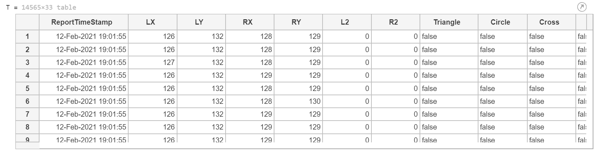
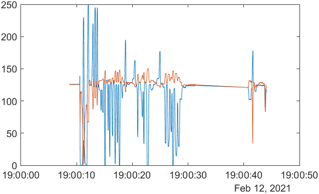
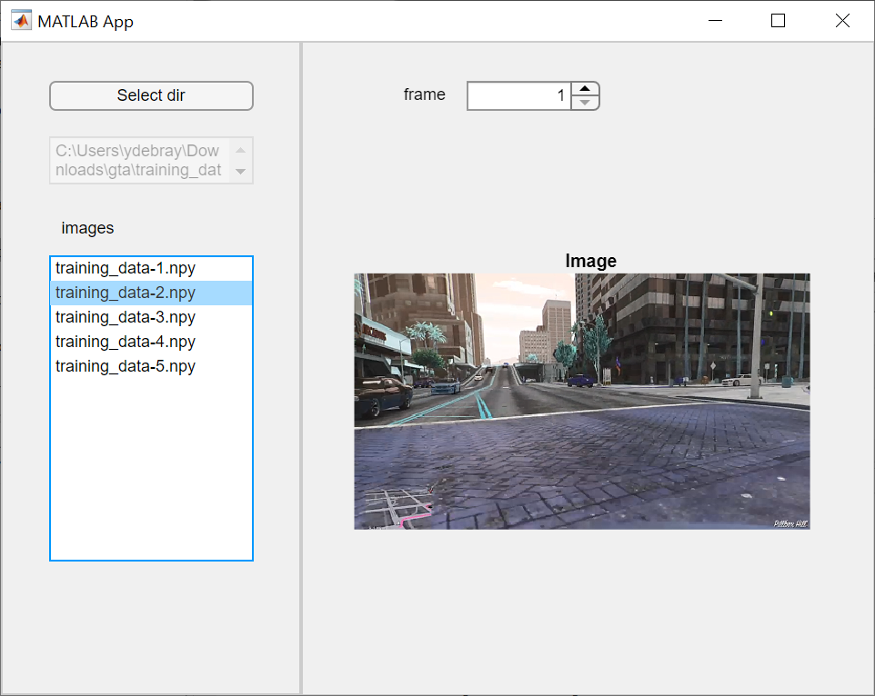
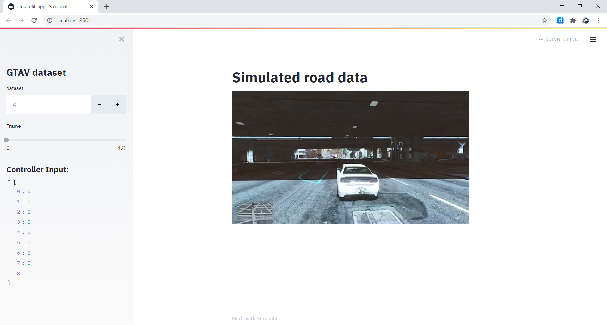
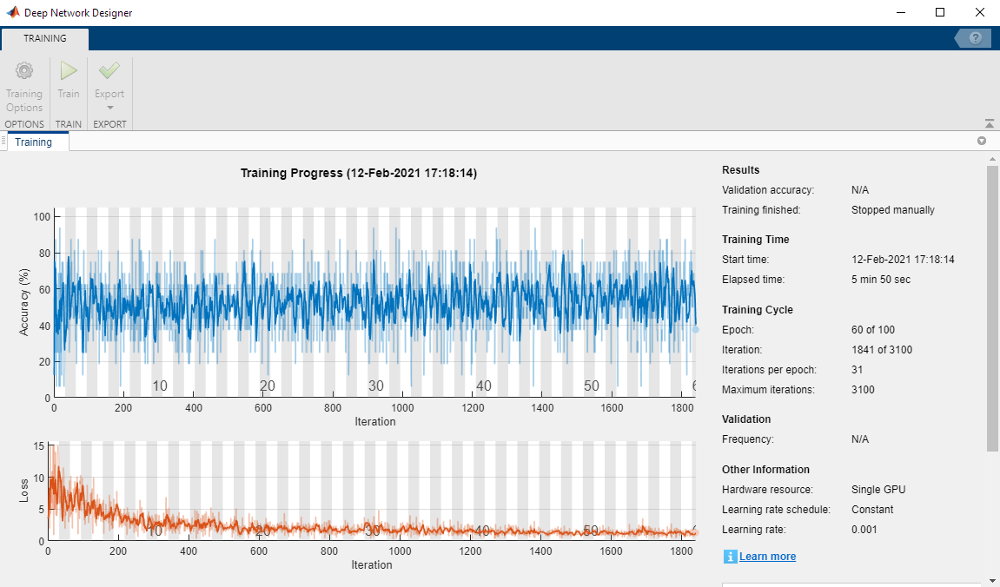
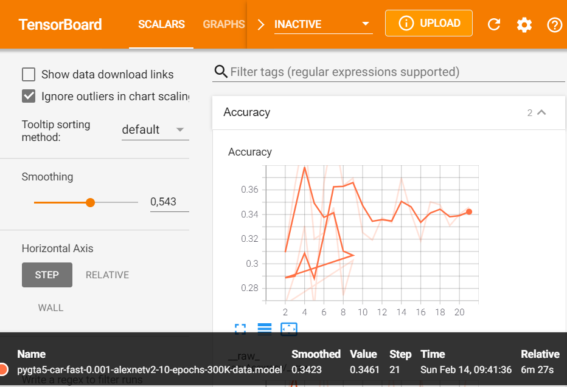
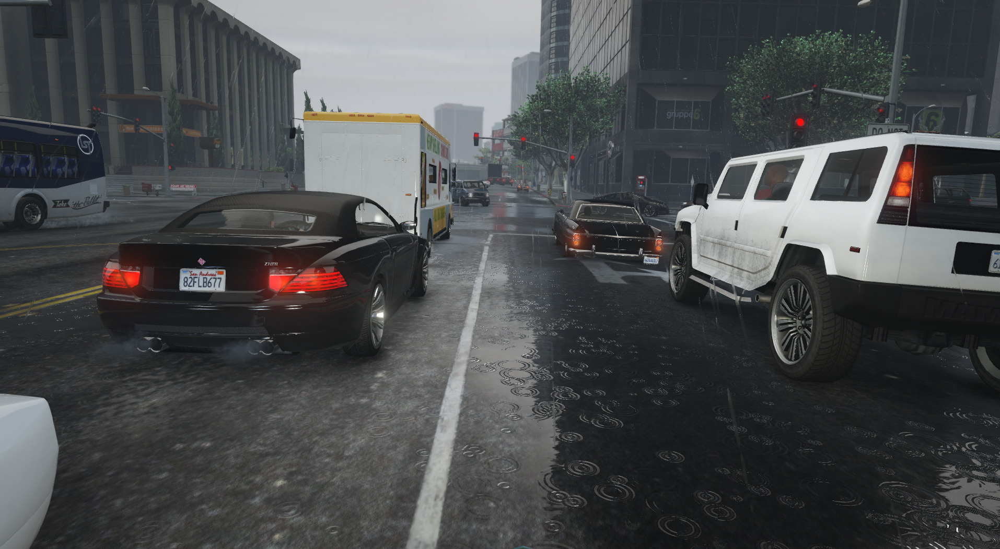
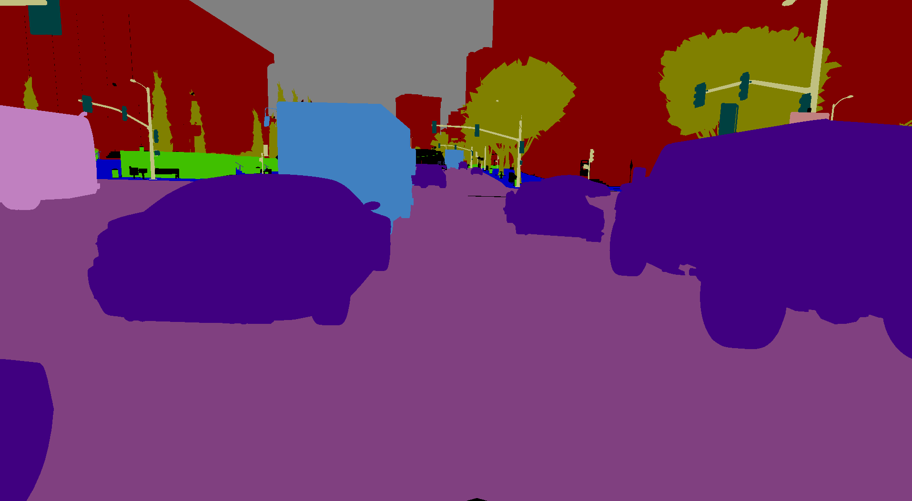
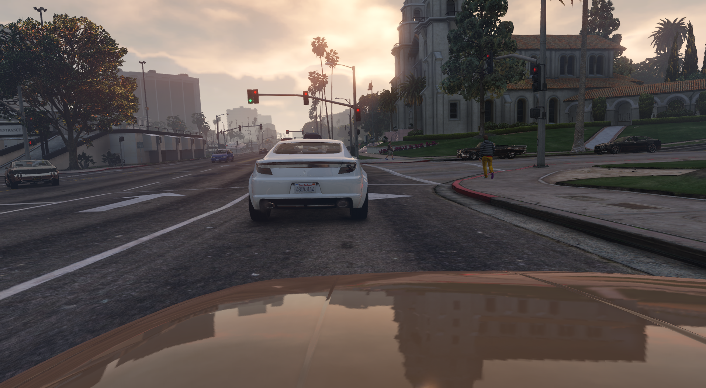
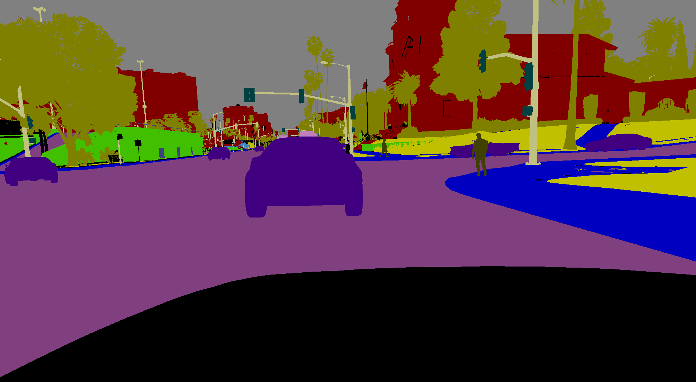

# AI plays GTA

**Content:**
1. [Record data](#data)
2. [Dataset browsing apps](#apps)
3. [Train model](#train)

The goal of this project is to develop a self-driving car in Grand Theft Auto V like in this example:

* [Tuto - Python Plays: Grand Theft Auto V](https://pythonprogramming.net/more-interesting-self-driving-python-plays-gta-v/)
* [sentdex Github](https://github.com/sentdex/pygta5/)
* [Youtube channel - Python Plays: Grand Theft Auto V](https://www.youtube.com/playlist?list=PLQVvvaa0QuDeETZEOy4VdocT7TOjfSA8a)
* [Self-driving motorbike video](https://youtu.be/nWJZ4w0HKz8?t=810)

## 1. Record data

### Record display

The first challenge is to record the display to replay it for further analysis (like a simple object detection following the car here):

### Record controller

We have 2 options:
* [Get the controller input directly](https://github.com/komefai/PS4Macro)
* [Map the command to the Keyboard](https://github.com/starshinata/PS4-Keyboard-and-Mouse-Adapter)

The folder [ps4_macro](ps4_macro) contains the controller record and python functions
[PS4_control.py](ps4_macro/PS4_control.py) provides 2 functions to: 
* **read** XML controller file as DataFrame, 
* **save** it as Excel file

[PyWin32](https://pypi.org/project/pywin32/) to record keyboard

**/!\\** Map A to Q on French keyboard!!!

## 3. Dataset browsing apps

### MATLAB desktop App

### Streamlit Web App

## 4. Train model 

### MATLAB Deep Learning toolbox

### Tensorflow

1 epoch only with [training0.py](2_train_model/training0.py)

Tensorflow on i7-6700HQ CPU @ 2.60GHz / 8Go RAM
21 steps == 6m 27s

I stopped it to train on my GPU instead

Tensorflow on NVIDIA GeFOrce GTX 960M
21 steps == 3m 40s
92 steps == 17m 6s

## Sources: 
* [Building a Self-Driving Vehicle in GTA-V Using Deep Learning and Convolutional Neural Network](https://medium.com/@alzaibnasiruddin/building-a-self-driving-vehicle-in-gta-v-using-deep-learning-and-convolutional-neural-network-696b38b4c81e)
* https://github.com/Alzaib/Autonomous-Self-Driving-Car-GTA-5
* https://medium.com/@alexlau27/playing-ps4-with-tensorflow-2-1-and-alexnet-2aeec0e2a5d8
* https://github.com/komefai/PS4Macro
* https://github.com/starshinata/PS4-Keyboard-and-Mouse-Adapter

## Go Further:

### Python plays GTA V

[GTA_5_steering.ipynb](Autonomous-Self-Driving-Car-GTA-5/GTA_5_steering.ipynb)

### [Playing for Data: Ground Truth from Computer Games](https://download.visinf.tu-darmstadt.de/data/from_games/index.html)
* https://bitbucket.org/visinf/projects-2016-playing-for-data/src/master/
* https://arxiv.org/abs/1608.02192
* http://download.visinf.tu-darmstadt.de/data/from_games/data/eccv-2016-richter-playing_for_data.pdf

| GTA driving data                  | semantic sampling                         | 
| ----------------------------------|:-----------------------------------------:|
|  |  |
|  |  |

### [LiDAR-GTA-V](https://github.com/UsmanJafri/LiDAR-GTA-V)

### [Precise Synthetic Image and LiDAR (PreSIL) Dataset](https://uwaterloo.ca/waterloo-intelligent-systems-engineering-lab/projects/precise-synthetic-image-and-lidar-presil-dataset-autonomous) from Waterloo Intelligent Systems Engineering Lab

Linearized Depth Map (~~Grey and~~ Colour)

Object Instance Segmentation

## More inspiration:

* https://github.com/aitorzip/DeepGTAV
* https://github.com/aitorzip/VPilot
* https://github.com/cpgeier/SantosNet
* https://ps4mousetocontroller.com/download.jsp
* [OpenCV Python Tutorial - Find Lanes for Self-Driving Cars](https://www.youtube.com/watch?v=eLTLtUVuuy4&ab_channel=ProgrammingKnowledge)

